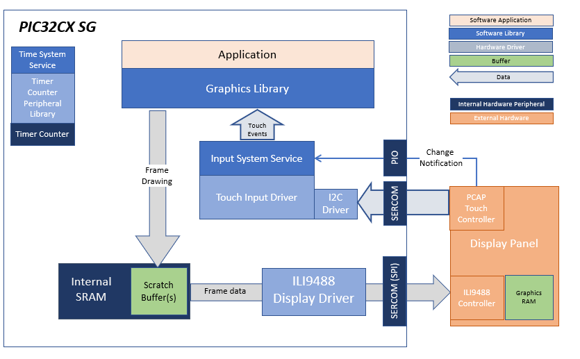
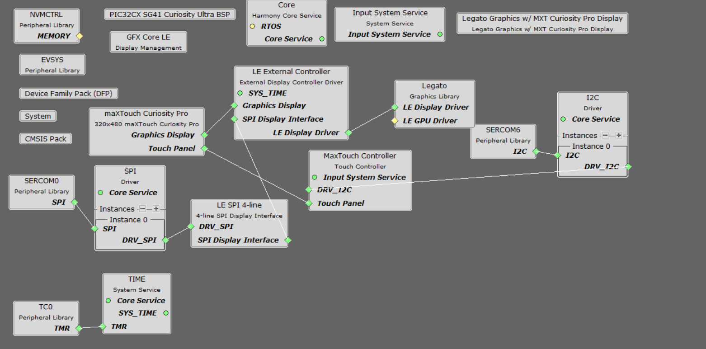
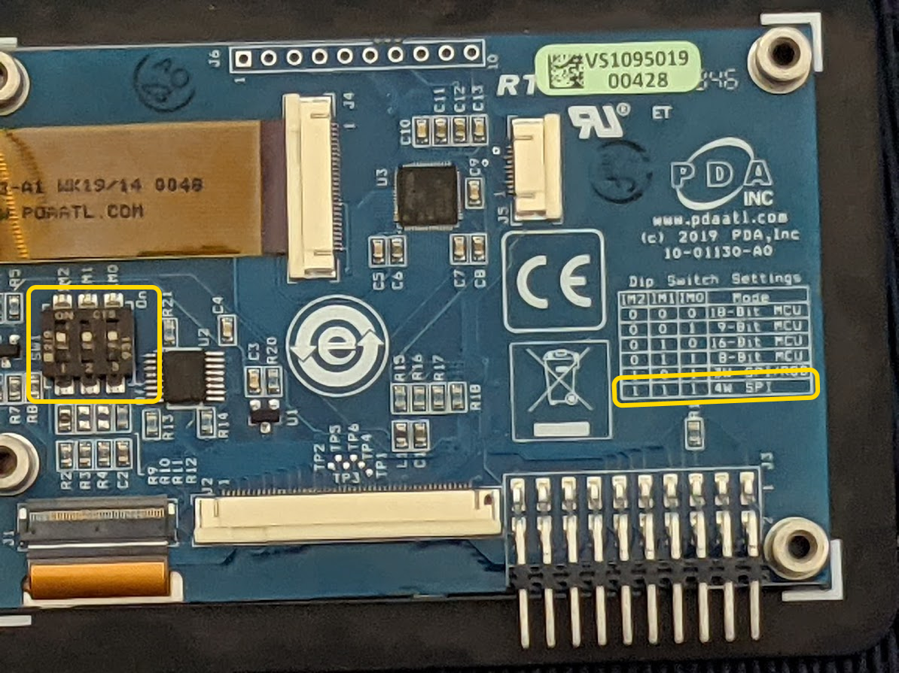
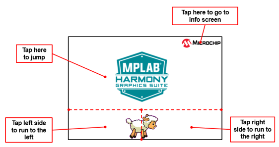

 legato\_adv\_cx\_sg41\_cu\_mxt\_cpro\_spi.X

Defining the Architecture
-------------------------

This application demonstrates single-layer sprite animation capability of the Legato library. This configuration comprises of an PIC32CX SG41 Curiosity Ultra Board with a maXTouch® Curiosity Pro Board. The sprites can be controlled via touch input received from the user.

User touch input on the display panel is received thru the PCAP capacitive touch controller, which sends a notification to the Touch Input Driver. The Touch Input Driver reads the touch information over I2C and sends the touch event to the Graphics Library thru the Input System Service.

### Demonstration Features 

* Legato Graphics Library 
* ILI9488 display controller driver 
* 4-line SPI display interface driver 
* Time system service, timer-counter peripheral library and driver 
* 16-bit RGB565 color depth support (65535 unique colors) 
* Port, I2C peripheral library 

Creating the Project Graph
--------------------------

The Project Graph diagram shows the Harmony components that are included in this application. Lines between components are drawn to satisfy components that depend on a capability that another component provides.

Adding the **PIC32CX SG41 Curiosity Ultra BSP** and **Legato Graphics w/ MXT Curiosity Pro Display** Graphics Template component into the project graph will automatically add the components needed for a graphics project and resolve their dependencies. It will also configure the pins needed to drive the external peripherals like the display and the touch controller. 

**Note: Replace the existing display driver LE ILI9488 with LE External Controller.**

Building the Application
------------------------

The parent directory for this application is apps/legato_adventure. To build this application, use MPLAB X IDE to open the apps/legato_adventure/firmware/legato_adv_cx_sg41_cu_mxt_cpro_spi.X project file. 

The following table lists configuration properties: 

| Project Name  | BSP Used |Graphics Template Used | Description |
|---------------| ---------|---------------| ---------|
| legato_adv_cx_sg41_cu_mxt_cpro_spi.X | PIC32CX SG41 Curiosity Ultra BSP | Legato graphics w/ maXTouch Curiosity Pro Display  | PIC32CX SG41 Curiosity Ultra w/ maXTouch Curiosity Pro display via SPI interface |

> \*\*\_NOTE:\_\*\* This application may contain custom code that is marked by the comments // START OF CUSTOM CODE ... and // END OF CUSTOM CODE. When using the MPLAB Harmony Configurator to regenerate the application code, use the "ALL" merging strategy and do not remove or replace the custom code.

Configuring the Hardware
------------------------

The final setup should be: 

Set the IM switches on the MXT Curiosity Pro Display to IM[2:0] = 111b.

Running the Demonstration
-------------------------

The application first boots to an animated Splash Screen. Once the Splash Screen animation completes, the application loads a Main Screen.

When at rest, the demo will cycle through idle sprite animations. Various areas of the screen are touch interactive

If initiated to run, the lamb sprite will run to the end of the screen, and play out a sequence of crashing into a wall, hurt and dizzy animations.

Tap Jump and the lamb will play out a jump animation.

Info Screen describes the features supported by this demo

* * * * *
