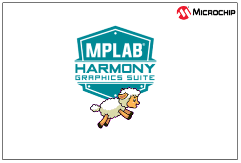

---
parent: Example Applications
title: Legato Adventure
nav_order: 3
---

# Legato Quickstart

This application demonstrates sprite animation capabilities using the graphics library. The application first launches a splash screen highlighting basic motion capability supported by the graphics library then transitions to the main screen.

|MPLABX Configuration|Board Configuration|
|:-------------------|:------------------|
|[legato\_adv\_cx\_sg41\_cu\_mxt\_cpro\_spi.X](./firmware/legato_adv_cx_sg41_cu_mxt_cpro_spi.X/readme.md)| [PIC32CX SG Curiosity Ultra Development Board](https://www.microchip.com/en-us/development-tool/ev06x38a) and a [maXTouch® Curiosity Pro Board](https://www.microchip.com/Developmenttools/ProductDetails/AC320007) |

