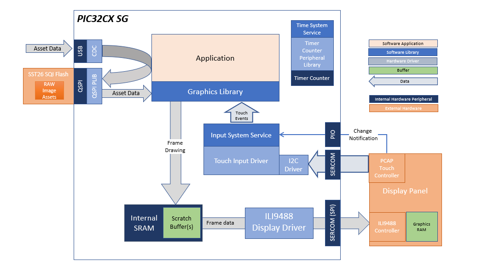
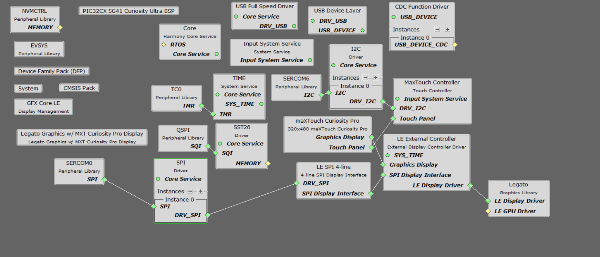
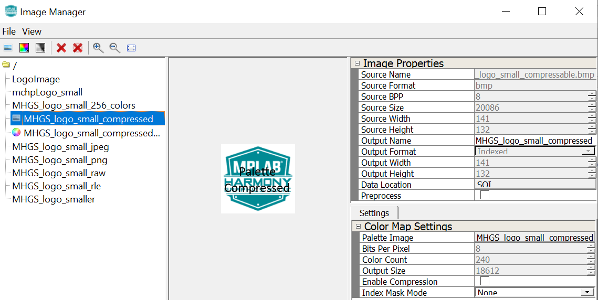
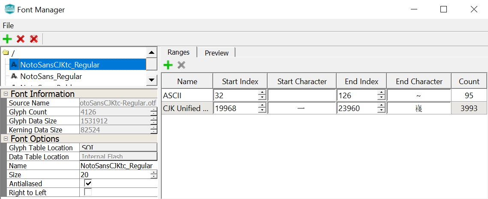
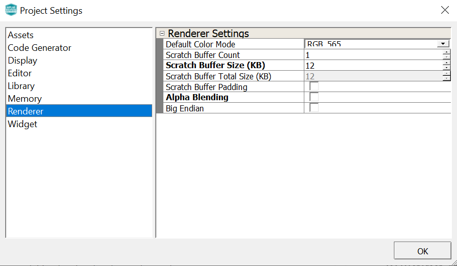
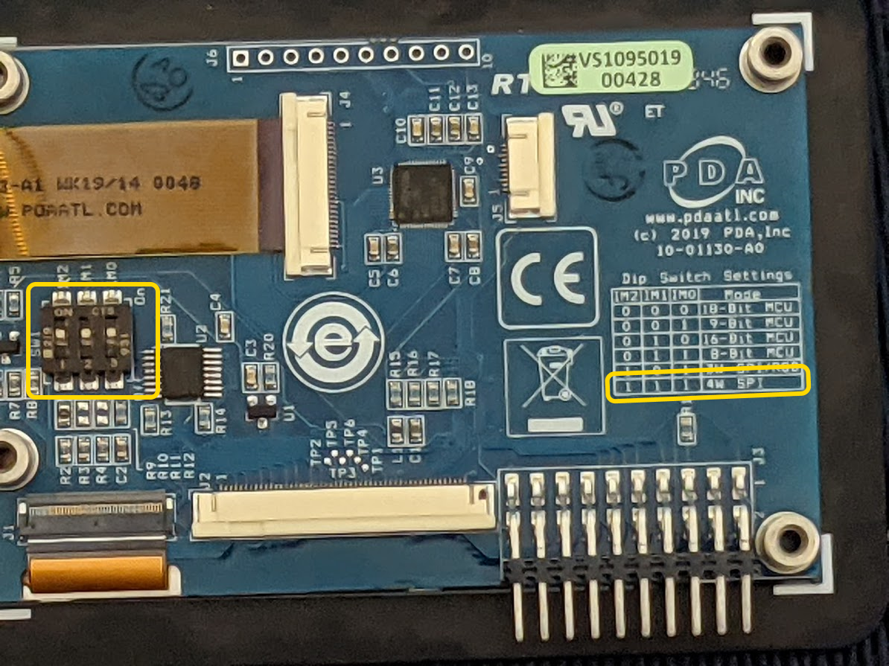

 legato\_ext\_res\_cx\_sg41\_cu\_mxt\_cpro\_spi.X

Defining the Architecture
-------------------------

The legato_ext_res application uses the built-in USB peripheral on the PIC32CX SG41 Curiosity Ultra board and configures the Target USB port on the development kit to work as a serial port by using the MPLAB Harmony 3 USB Device Stack.

This serial connection is used to transfer and program a binary (.bin) file which contains graphics resources (images and font glyphs) into the external non-volatile SQI Flash.

This configuration runs on the PIC32CX SG41 Curiosity Ultra Development Kit with a maXTouch® Curiosity Pro Board. The Legato Graphics Library is used to render graphics to the display.

The application populates some of its widgets from assets stored on on-chip NVM and other parts of it, from assets stored on a non-volatile QSPI flash memory through the **Setup** mode provided in the application.

The USB peripheral receives a file named **SQI.bin** through a USB connection to a PC via a serial terminal program client (TeraTerm). The application reads this binary file and writes it to external non-volatile memory via the SQI peripheral.

### Demonstration Features 

* Legato Graphics Library 
* ILI9488 display controller driver 
* 4-line SPI display interface driver 
* Time system service, timer-counter peripheral library and driver 
* 16-bit RGB565 color depth support (65535 unique colors) 
* Port, I2C peripheral library 
* QSPI peripheral library
* USB Full Speed driver
* Images and Fonts for user interface stored in internal and external NVM memory

Creating the Project Graph
--------------------------

The Project Graph diagram shows the Harmony components that are included in this application. Lines between components are drawn to satisfy components that depend on a capability that another component provides.

Adding the **PIC32CX SG41 Curiosity Ultra BSP** and **Legato Graphics w/ MXT Curiosity Pro Display** Graphics Template component into the project graph will automatically add the components needed for a graphics project and resolve their dependencies. It will also configure the pins needed to drive the external peripherals like the display and the touch controller. 

Additional components to support USB, SQI, I2C and SERCOM Driver needs to be added and connected manually.

**Note: Replace the existing display driver LE ILI9488 with LE External Controller. For SQI Flash access, make sure all 6 pins for QSPI is mapped.**

**Configuring Assets for External Storage**
--------------------------

Asset Streaming Interfaces
--------------------------

To support external assets, in MPLAB® Harmony Graphics Composer under 'Project -> Project Settings -> Library', enable 'Streaming Interface'.  

The Legato Graphics Library generated code will call to the external asset streaming interfaces:

**leResult leApplication_MediaOpenRequest**

**leResult leApplication_MediaReadRequest** 

**void leApplication_MediaCloseRequest**

These interfaces must be implemented in application code for to route asset data from the external storage medium into the Legato Graphics Library. 

External Asset Storage Locations
--------------------------

Memory locations are configured in MPLAB® Harmony Graphics Composer under 'Project -> Memory Locations'.

The location 'SQI' is configured to create a binary file called 'SQI.bin'.  All assets assigned to this location will be generated in RAW binary format as part of this file.

The following assets are assigned to this location:

1) One RAW Image

2) One JPEG Image

3) One Palette Compressed Image

4) One Noto-Sans CJK font including custom CJK Unified Ideographs font range

**Note:**
PNG image and RLE Image is excluded in this demo since, a larger allocation of variable heap is essential for PNG and RLE decoding to operate. 

Application Code Implementation
--------------------------

Here is the pseudo code explanation of how the application code is implemented in [app.c](../src/app.c).

On launch, the application renders the default screen.  As the Legato Graphics Library draws the default screen, it will call the streaming interfaces as needed.

**leResult leApplication_MediaOpenRequest** is implemented to operate the stream in blocking mode and to wait until transfer status gets completed.

**leResult leApplication_MediaReadRequest** is implemented to read data from the QSPI Flash based on address and size requested by the Legato Graphics Library.

**void leApplication_MediaCloseRequest** is empty in this example, but can be used to close the driver if needed.

**event_default_LogoButton_OnReleased** button release event is implemented to toggle between English and Chinese.

**event_default_SloganButton_OnReleased** button release event is implemented to cycle images and strings from 8bit LUT Palette, RAW and JPEG.  These assets are stored in the external QSPI Flash.

Memory Management Settings
--------------------------

There are several memory settings that are non-default in this application.  These settings were derived on trial-and-error basis with visual observation of the applications graphics draw performance.

The following window is the Library tab in Project Settings in MPLAB® Harmony Graphics Composer:

JPEG Decoder Cache Size is increased to 2048 bytes.  This sets the size of the memory cache in JPEG Decoder streaming interface.  On first request for pixel, the interface pre-fetches this amount from the JPEG image file.  This improves JPEG pixel draw speed. Note that for maximum efficiency, the setting value should be divisble by the default file system block size, typically 512 bytes.

Font Cache Size is increased to 4096 bytes.  This sets the size of the memory cache in Font streaming interface.  It must be able to hold the largest rasterized glyph in the design. 

The following window is the Memory tab in Project Settings in MPLAB® Harmony Graphics Composer:

 

The majority of Legato Graphics Library's normal operation utilizes memory from the fixed memory pool.  The pool sizes are default to the best optimal settings based-on simulation during development of the library.

The following window is the Renderer tab in Project Settings in MPLAB® Harmony Graphics Composer:

The scratch buffer size is set to 12 Kilobytes. This setting is based on the guide lines for Scratch Buffer settings on the Graphics Wiki [https://github.com/mchpgfx/legato.docs/wiki/Adjusting-Scratch-Buffer-Size](https://github.com/mchpgfx/legato.docs/wiki/Adjusting-Scratch-Buffer-Size).

Building the Application
------------------------

The parent directory for this application is apps/legato_ext_res. To build this application, use MPLAB X IDE to open the apps/legato_ext_res/firmware/legato_ext_res_cx_sg41_cu_mxt_cpro_spi.X project file. 

The following table lists configuration properties: 

| Project Name  | BSP Used |Graphics Template Used | Description |
|---------------| ---------|---------------| ---------|
| legato_ext_res_cx_sg41_cu_mxt_cpro_spi.X | PIC32CX SG41 Curiosity Ultra BSP | Legato graphics w/ maXTouch Curiosity Pro Display  | PIC32CX SG41 Curiosity Ultra w/ maXTouch Curiosity Pro display via SPI interface |

> \*\*\_NOTE:\_\*\* This application may contain custom code that is marked by the comments // START OF CUSTOM CODE ... and // END OF CUSTOM CODE. When using the MPLAB Harmony Configurator to regenerate the application code, use the "ALL" merging strategy and do not remove or replace the custom code.

Configuring the Hardware
------------------------

The final setup should be: 

Set the IM switches on the MXT Curiosity Pro Display to IM[2:0] = 111b.

**Note: Connect the USB cable to the **Target USB** port from the PC. This can be connected before or at any point after the application is powered-on.

Running the Demonstration
-------------------------

When power-on is successful, the demonstration will populate the screen with 2 buttons **Setup** and **Application**:

If a valid USB connection is made to PC and configured, the LED2 (orange) will light up.

Press and release the **Setup** button to go to the Setup screen.

If the data transfer to QSPI is successfully verified, the LED1 will light up.

**Note: When there is an issue in establishing the USB connection, LED1 toggles.**  
**Note: Similarly, When QSPI data transfer fails during verification, LED2 toggles.** 

Press and release the **Erase & Update SQI Flash** button on-screen. Next press and release the **Yes** button. The application will wait for the the data transfer from the PC on release of the button. 

Next, use your favorite Terminal program on the PC and open a **new connection**.

The asset binary should be in the file **.legato_generate_cache.zip**, inside the project's config folder:
apps\\legato_ext_res\\firmware\\src\\config\\lcc_rgb565_mxt_ck_cu\\.legato_generate_cache.zip\\SQI.bin

Extract the .zip archive to a folder of your choosing and send the file named **SQI.bin** from the PC to the device using the terminal.

Now send file **SQI.bin** using the Terminal program from the PC.

LED1, on lower left side of the Curiosity board in the picture, will Light up when the file is flashing successfully. It will then display a downloading progress to indicate the transfer.

Once the transfer is complete, press the **Update SQI Flash** button and wait until you see the message "**update complete**".

You can then press the **Restart Application** button to return back to the introduction screen and start the demo by pressing the **Application** button.

Press and release the application button.

Pressing the button will cause the application to load a new image. The image cycles in order from Palette Compressed to Uncompressed RAW with Direct Blit, Uncompressed RAW to JPEG.

The MPLAB Harmony Graphics Suite logo is also a button. Pressing the logo will toggle the application between English and Simplified Chinese.

Note that all images and glyphs are retrieved from the external SQI Flash.

The application is purposely setup in single-buffer configuration to allow the visual inspection of the data retrieval speed when loading the various images and glyphs.
* * * * *

