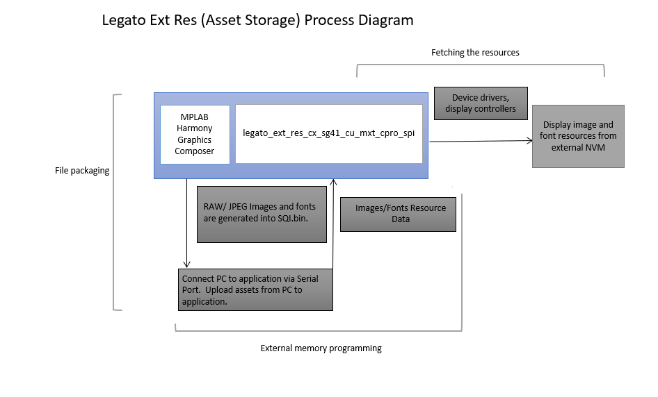

---
parent: Example Applications
title: Legato External Resources
nav_order: 3
---

# Legato Quickstart

This project showcases how the Microchip Harmony Graphics Suite can be used to package images and font glyphs to be stored in external non-volatile memory, specifically a QSPI/SQI/NOR Flash.
The Microchip Graphics Composer plugin simplifies the process of generating binary files that need to be copied onto the external memory.

The Setup section allows the user to program the external SQI flash with ease via the Target USB port on the evaluation kit i.e. the MCU's USB Device Port.

The Application section demonstrates how the Legato Graphics Library can be setup to retrieve these external resources at runtime.

legato_x_r_ck_cu_wqvga.X stores and retrieves resources stored on the on-board SST26VF064BA-104I/SM SQI flash memory.

|MPLABX Configuration|Board Configuration|
|:-------------------|:------------------|
|[legato\_ext\_res\_cx\_sg41\_cu\_mxt\_cpro\_spi.X](./firmware/legato_ext_res_cx_sg41_cu_mxt_cpro_spi.X/readme.md)| [PIC32CX SG Curiosity Ultra Development Board](https://www.microchip.com/en-us/development-tool/ev06x38a) and a [maXTouch® Curiosity Pro Board](https://www.microchip.com/Developmenttools/ProductDetails/AC320007) |

